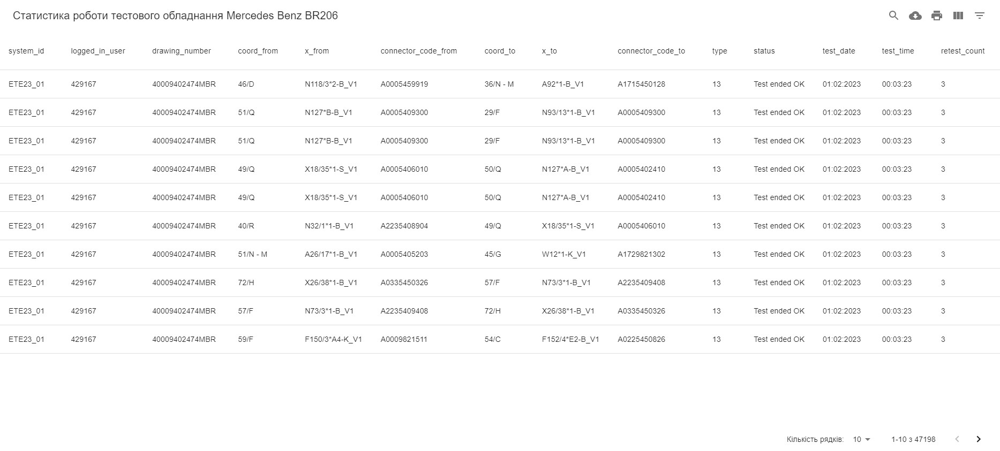
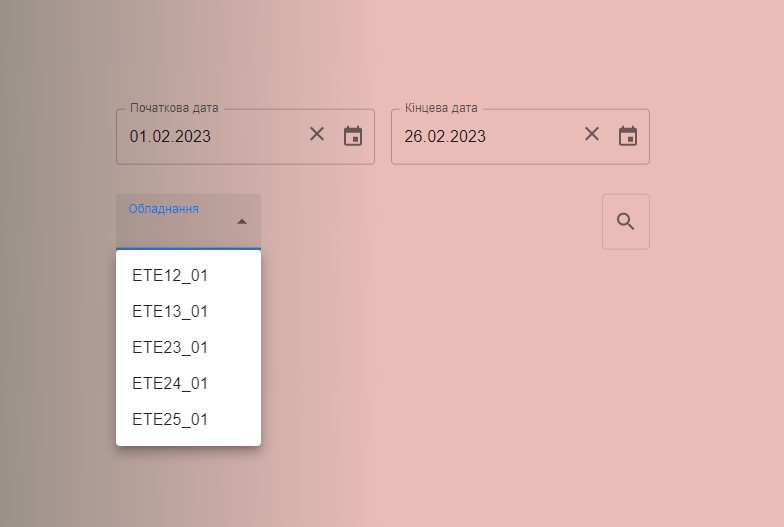

This application was made for quick access to test equipment error statistics (errors of harness during the test).

The application is made for automotive industry and actively used on Leoni AG in Kolomyia





The code require compilation by using NodeJs 14

Download the project and run scripts:
```
npm i
npm build
```
